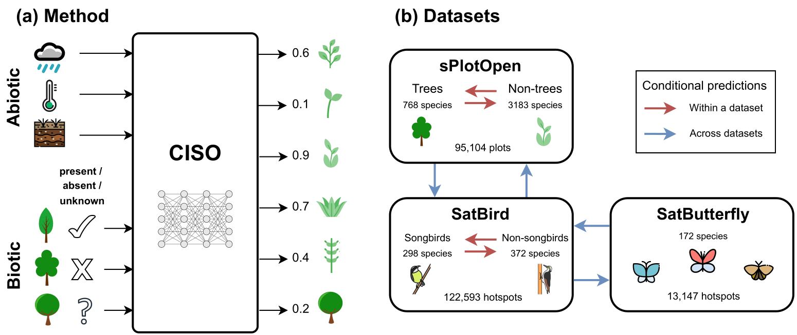

# CISO-SDM 🐦🦋🌿

This repository contains the code to reproduce the results from the paper: 

### CISO: Species Distribution Modeling Conditioned on Incomplete Species Observations

<br>

<div align="left">

</div>

<br>

## 🛠️ Installation

### ⚙️ Requirements

This project requires **Python 3.11**. All dependencies are listed in `requirements/requirements.txt`. 

We recommend using **Conda** to create and manage a clean environment:

```bash
conda create -n ciso_env python=3.11
conda activate ciso_env
pip install -r requirements/requirements.txt
```

#### 💡Not using Conda?

You can also use a standard Python virtual environment:

```bash
python3.11 -m venv ciso_env
source ciso_env/bin/activate # On Windows use `ciso_env\Scripts\activate`
pip install -r requirements/requirements.txt
```

### 🖥️ Hardware Support

The results can be reproduced on any device (GPU, eGPU, or CPU), though the computational time will vary depending on the hardware's parallel processing capabilities. If you encounter memory issues, especially on lower-end devices, consider reducing the batch size in the training configuration to mitigate them. You may also need to install or update the appropriate NVIDIA drivers to work with PyTorch, depending on your specific setup.

## 📂 Datasets

All datasets used in the paper are publicly available [here](https://huggingface.co/cisosdm/datasets) on Hugging Face.

#### Data preparation scripts

Data preparation code is located in the `data_preprocessing/` folder:

* SatButterfly: `ebutterfly_data_preparation.ipynb`
* sPlotOpen: `prepare_sPlotOpen_data.ipynb`
* SatBird × sPlotOpen (co-located data): `prepare_satbirdxsplots.ipynb`

## 🔬 Experiment configurations:

The `configs` directory contains subfolders for each dataset setup:

* `configs/satbird`
* `configs/satbirdxsatbutterfly`
* `configs/satbirdxsplot`
* `configs/splot`

Each subfolder includes YAML config files for models reported in the paper. These configs are used for both training and evaluation.

| File                       | Model Description                 |
|----------------------------|-----------------------------------|
| `config_ciso.yaml`         | CISO model                        |
| `config_linear.yaml`       | Linear model                      |
| `config_maxent.yaml`       | Linear model with MaxEnt features |
| `config_mlp.yaml`          | MLP                               |
| `config_mlp_plusplus.yaml` | MLP++                             |

## 🤖 Trained model checkpoints:

All trained model checkpoints are available [here](https://huggingface.co/cisosdm/model_checkpoints).
For each dataset, each folder includes 3 sub-folders corresponding to 3 different runs (seeds).

| Folder                   | Description                                              |
|--------------------------|----------------------------------------------------------|
| `1_sPlotOpen`            | Within-dataset experiments for sPlotOpen                 |
| `2_SatBird`              | Within-dataset experiments for SatBird                   |
| `3_SatBirdxSatButterfly` | Across-datasets experiments for SatBird and SatButterfly |
| `4_SatBirdxsPlotOpen`    | Across-datasets experiments for SatBird and sPlotOpen    |

## 🚀 Running code

### 🔹 Training
You can log experiments using [Comet ML](https://www.comet.com/site/). To enable logging, make sure to export your `COMET_API_KEY` and `COMET_WORKSPACE` environment variables:

```bash
export COMET_API_KEY=your_comet_api_key
export COMET_WORKSPACE=your_workspace
```

To train a model, run:

```bash
python train.py args.config=configs/<dataset>/<model_config>.yaml
```

Examples of configuration files for different datasets and models can be found in the `configs/` directory.

### 🔹 Evaluation

Use the `predict_family_of_species` parameter to control the subset of species evaluated. This parameter defaults to`-1` during training (i.e., not used).

#### Evaluating species groups *within* a dataset

🐦 **SatBird**:
- `predict_family_of_species = 0` → evaluate **non-songbirds**
- `predict_family_of_species = 1` → evaluate **songbirds**

🌿 **sPlotOpen**:
- `predict_family_of_species = 0` → evaluate **non-trees**
- `predict_family_of_species = 1` → evaluate **trees**


#### Evaluating species groups *across* datasets
🐦🦋 **SatBird & SatButterfly**:
- `predict_family_of_species = 0` → evaluate **birds**
- `predict_family_of_species = 1` → evaluate **butterflies**

🐦🌿**SatBird & sPlotOpen**:
- `predict_family_of_species = 0` → evaluate **plants**
- `predict_family_of_species = 1` → evaluate **birds**


#### Conditioning on other species groups

For models that support partial labels (i.e., CISO and MLP++), evaluation can be conditioned on the observations of species from another group:

- `partial_labels.eval_known_rate == 0 ` → evaluate with no partial labels (all other species groups are unknown)
- `partial_labels.eval_known_rate == 1 `  → evaluate with partial labels (labels from the other species group are
  provided)


## 📊 Reproducing Results and Figures

You can reproduce the key results and figures from the paper using the scripts and notebooks provided below:

### 📈 Results

To reproduce the results on Tables 1 & 2, as well as additional metrics in Table 5, you first download
the `model_checkpoints` folder from [here](https://huggingface.co/cisosdm/model_checkpoints).
For a certain dataset and model, you run the following command given the corresponding config file, and specify the
desired file name to save results.
For the config file specified, you need to control the following parameters:

| Parameter                         | Description                                                                 |
|-----------------------------------|-----------------------------------------------------------------------------|
| `load_ckpt_path`                  | Path to the checkpoints folder or exact checkpoint path.                    |
| `predict_family_of_species`       | Controls which family of species to evaluate  as shown above in Evaluation. |
| `partial_labels/eval_known_ratio` | Set to 1, to condition on known labels for the other group of species.      |

```bash
python test.py args.config=configs/<dataset>/<model_config>.yaml args.results_file_name=<results_file_name.csv>
```

##### Example:

To reproduce results for CISO on SatBird, use `configs/satbird/config_ciso.yaml`. Set `load_ckpt_path`
to `model_checkpoints/2_SatBird/satbird_ciso` to evaluate the 3 different runs.

* Evaluate **songbirds Unconditioned**: `predict_family_of_species = 1`.
* Evaluate **non-songbirds Unconditioned**: `predict_family_of_species = 0`.
* Evaluate **songbirds** **Conditioned** on non-songbirds: `predict_family_of_species = 1` and `eval_known_ratio = 1`.
* Evaluate **non-songbirds** **Conditioned** on songbirds: `predict_family_of_species = 0` and `eval_known_ratio = 1`.

### 🖼️ Figures
* Figure 3: `figures/generate_figure_3.ipynb`
* Figure 4: `figures/generate_figure_4.ipynb`
* Figure 5: `figures/generate_figure_5.ipynb`

## 📜 License
This work is licensed under a
[Creative Commons Attribution-NonCommercial 4.0 International (CC BY-NC 4.0) License](https://creativecommons.org/licenses/by-nc/4.0/).
